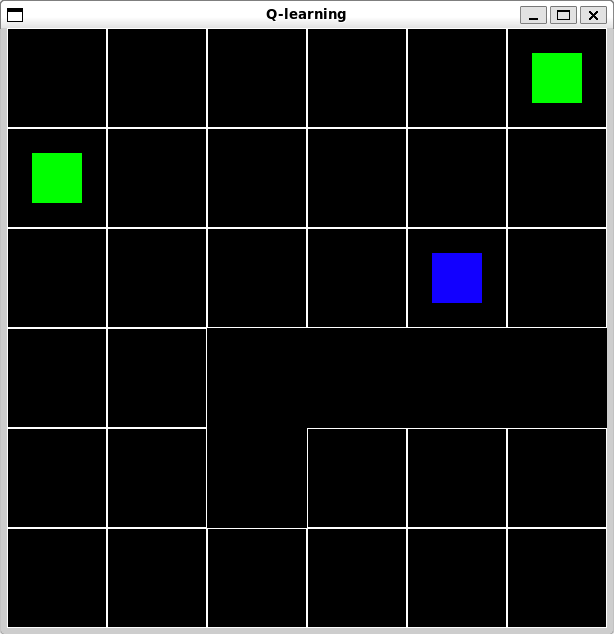
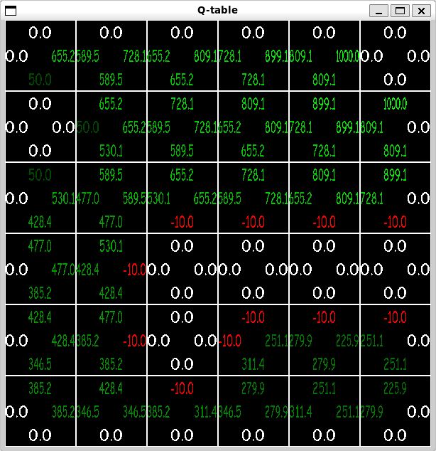

# Reinforcement learning (Q-learning)

An implementation of Q-learning on a 2D map, with a CLI and a GUI.

Map | Q-table
:-:|:-:
 | 

## Table of contents
1. [Requirements](#requirements)
2. [Compilation](#compilation)
3. [Usage](#usage)
    1. [Tips](#tips)
    2. [Graphical User Interface controls](#graphical-user-interface-controls)
    3. [Command Line Interface controls](#command-line-interface-controls)
4. [Graphical User Interface legend](#graphical-user-interface-legend)
5. [Pretrained Q-tables](#pretrained-q-tables)

## Requirements
This program need libsdl2-dev, libsdl2-ttf-dev, graphviz, doxygen, gcc and makefile to build and run.

```bash
sudo apt install libsdl2-dev libsdl2-ttf-dev graphviz doxygen gcc make
```
## Compilation
To generate program executable and Doxygen documentation:
```bash
make # or make all
```

To generate program executable:
```bash
make main
```
To generate Doxygen documentation:
```bash
make doxygen
```
To clean any generated files:
```bash
make clean
```

## Usage
```
Usage: ./main [options]
Options:
-epochs <int> (default: inf) : Number of training/testing epochs
-epsilon <float> (default: 0.01) : Exploration rate
-alpha <float> (default: 0.1) : Learning rate
-gamma <float> (default: 0.9) : Discount factor
-euclidean : Use euclidean distance instead of default reinforcement system
-teleporter : Enable teleporter in the environment
-loop : Make the agent go through goal 1, goal 2 and starting point
-test : Enable test mode instead of train mode
-load <filename> (default: NULL) : Load a saved Q-table from file
-save <filename> (default: NULL) : Save the Q-table to a file
-nogui : Disable the graphical user interface
-debug : Enable debug mode with the Q-table shown on the screen
-noprint : Disable printing information on the console
-help : Print the help message
```

### Tips
- For a faster training, run the program with `-nogui` and `-noprint`

### Command Line Interface controls
- `Ctrl+C` to quit the program.

### Graphical User Interface controls
- `space` to toggle slow mode for easier reading of shown information.
- `escape` or `q` to quit the program.
- `p` to pause the program.

## Graphical User Interface legend
- <span style="color:green">Green</span>: goal
- White: teleporter
- <span style="color:blue">Blue</span>: agent
- Black: wall


## Pretrained Q-tables
Some pretrained Q-tables are provided:
- `pretrained.txt`: standard map.
    - Run with `./main -load pretrained.txt [options]`.
- `pretrained_teleporter.txt`: map with teleporter enabled.
    - Run with `./main -load pretrained_teleporter.txt -teleporter [options]`.
- `pretrained_euclidean.txt`: standard map with euclidean distance reinforcement system.
    - Run with `./main -load pretrained_euclidean.txt -euclidean [options]`.
- `pretrained_euclidean_teleporter.txt`: map with teleporter enabled and euclidean distance reinforcement system.
    - Run with `./main -load pretrained_euclidean_teleporter.txt -teleporter -euclidean [options]`.